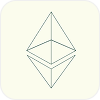

    

    <h1>GM, 欢迎来到 LXDAO Web3 开发者社区 👋</h1>

<h3>LXDAO 是一个研发驱动的 DAO，致力于帮助开源项目和公共物品进入可持续发展的无限循环（Infinite Cycle）</h3>

    <a href="./README.mdx" target="_blank">
    English
    </a>
    &nbsp;|&nbsp;
    <a href="./README_zh-CN.mdx" target="_blank">
    中文文档
    </a>

## 🏢 关于LXDAO

**🌈 我们的目标：** 通过汇聚优秀的web3人才，构建一个支持开源项目与公共物品，可持续发展的无限循环。

**🏁 如何实现：** 通过DAO（去中心化自治组织）的形式，让每个成员都可以在公开，透明，公平，自由的环境下，利用社区与国库资源完成自己的构想落地。

**👥 如何参与：** 任何人都可以自由 [**加入 LXDAO 社区**](https://lxdao.io/onboarding/intro)，我们重视个体的平等性，你可以通过实际的贡献来树立自己的影响力。 [**了解更多 👉**](https://docs.lxdao.io/docs/shen-fen-ti-xi)

    

### 

## 🚀 BuildPath

BuildPath 是当前研发 DAO 运行的主线，通过下列的的核心项目，形成从人才培养到项目落地，再到最后的激励循环，解决开源项目 人 + 钱 的可持续性问题。

| 项目 | 描述 | 进度 |
|------------|-------------|------|
| <a href="https://github.com/IntensiveCoLearning" target="_blank">📚 IntensiveCoLearning</a> | 让更多人学习需要用到的技术 | `50%` |
| <a href="https://github.com/lxdao-official/WhatToBuild" target="_blank">💡 WhatToBuild</a> | 分析、研究、整理创建应用想法，给大家创作灵感，避免重复做基础轮子 | `10%` |
| <a href="https://github.com/Casual-Hackathon" target="_blank">🎮 Casual Hackathon</a> | 休闲黑客松，不带奖金池不做 PR，回归纯粹黑客松，让大家脑爆、快速出 Demo 和 MVP [了解更多 👉](https://forum.lxdao.io/t/the-introduction-of-casual-hackathon/2827) | `10%` |
| <a href="https://fairsharing.xyz" target="_blank">🤝 FairSharing</a> | 记录贡献一起协作，让大家可以异步协作，公平分配，持久贡献 | `70%` |
| <a href="#" target="_blank">🏆 RetroFunding</a> | 追溯性奖励，选出认真工作、有结果产出的项目，增加额外和持续性激励 | `0%` |

## 🏗️ 关于Pod
Pod 是 LXDAO 快速、轻量、自主自发的工作小组，旨在为有潜力的项目提供资金、资源和指导，帮助它们成长为成熟的项目。

[Pod 小组概况 👉](https://www.notion.so/lxdao/Pod-1eadceffe40b804ea6fdf7a29f4edd4c)

<table width="100%" style="margin: 40px 0">
    <tbody>
        <tr>
            <td width="16.6%">
                

                    
                    

                        <a href="https://www.notion.so/lxdao/OP-Delegate-Pod-1bbdceffe40b80adb0faff72dcbab427" target="_blank">OP Delegate Pod</a>
                    

                

            </td>
            <td width="16.6%">
                

                    
                    

                        <a href="https://www.notion.so/lxdao/Onboarding-Pod-1bcdceffe40b80199e0bf63b773f7c3c" target="_blank">Onboarding Pod</a>
                    

                

            </td>
            <td width="16.6%">
                

                    
                    

                        <a href="https://www.notion.so/lxdao/Geth-Research-Pod-1d8dceffe40b80a5a683db785de45b6b" target="_blank">Geth Research Pod</a>
                    

                

            </td>
            <td width="16.6%">
                

                    
                    

                        <a href="//lxdao.io/projects/011" target="_blank">休闲黑客松 Pod</a>
                    

                

            </td>
            <td width="16.6%">
                

                    
                    

                        <a href="https://www.notion.so/lxdao/Pod-1eedceffe40b80d488f2d1fb8f22ba2d" target="_blank">以太坊实习手册 Pod</a>
                    

                

            </td>
            <td width="16.6%">
                

                    
                    

                        <a href="https://www.notion.so/lxdao/1b9dceffe40b814fa7caff334d19ec2f?v=1b9dceffe40b81cc8e37000cb244cbf3" target="_blank">更多Pod 👉</a>
                    

                

            </td>
        </tr>
    </tbody>
</table>

## 📚 开源项目

<table width="100%" style="margin: 40px 0">
    <tbody>
        <tr>
            <td width="16.6%">
                

                    
                    

                        <a href="https://lxdao.io/projects/024" target="_blank">Intensive Co-learning</a>
                    

                

            </td>
            <td width="16.6%">
                

                    
                    

                        <a href="https://lxdao.io/projects/021" target="_blank">ETHPanda Collaboration</a>
                    

                

            </td>
            <td width="16.6%">
                

                    
                    

                        <a href="https://lxdao.io/projects/012" target="_blank">FairSharing</a>
                    

                

            </td>
            <td width="16.6%">
                

                    
                    

                        <a href="https://lxdao.io/projects/011" target="_blank">EIP Fun</a>
                    

                

            </td>
            <td width="16.6%">
                

                    
                    

                        <a href="https://lxdao.io/projects/010" target="_blank">MyFirstLayer2</a>
                    

                

            </td>
            <td width="16.6%">
                

                    
                    

                        <a href="https://lxdao.io/projects" target="_blank">查看项目 👉</a>
                    

                

            </td>
        </tr>
    </tbody>
</table>